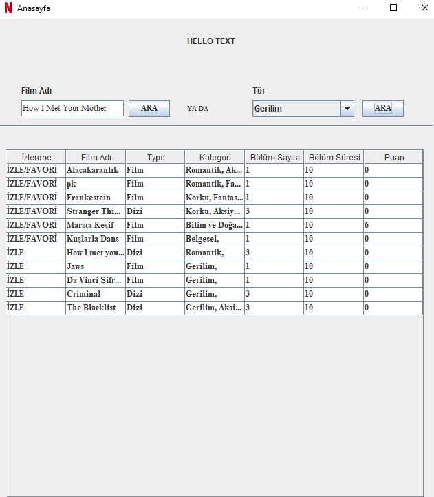
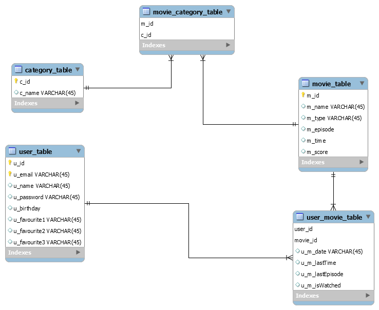

### Netflix Desktop App

Uygulama iki farklı arayüzden oluşuyor: 

● Kullanıcı giriş/kayıt sayfası. 

● Kullanıcın içerik arayabileceği ve izleyebileceği arayüz.

## Kullanıcı İçerik Arayüzü

  

## DB UML Diagramı

  

