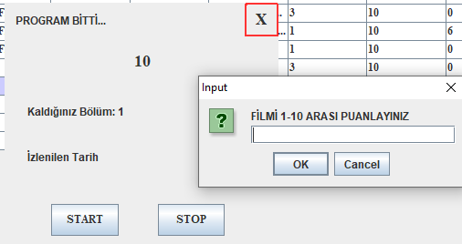

## Netflix Desktop App

Uygulama iki farklı arayüzden oluşuyor: 

● Kullanıcı giriş/kayıt sayfası. 

● Kullanıcın içerik arayabileceği ve izleyebileceği arayüz.

### Kullanıcı İçerik Arayüzü

  

### İçeriği Temsili Bir Ekran ve Timer ile İzleme,Puanlama

  

                                                       
### DB UML Diagramı

  

